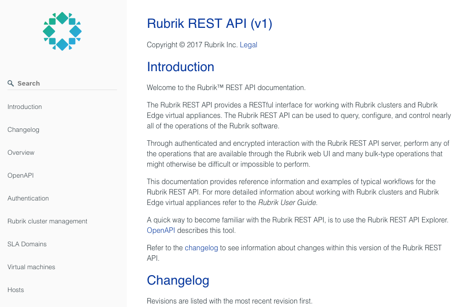

# API Documentation

To view Rubrik’s built-in API documentation:

Open a new tab in your web browser and navigate to Rubrik REST API Specifications bookmark \(bookmarked in the Chrome web browser\).

Browse through the documentation to learn more about Rubrik APIs and how they may be used.

Scroll down to **SLA Domains** &gt; **Retrieving SLA Domains**. Take a look at the information provided in this section.

The documentation provides code snippets and parameters to make it easy for you to learn and use our APIs.

