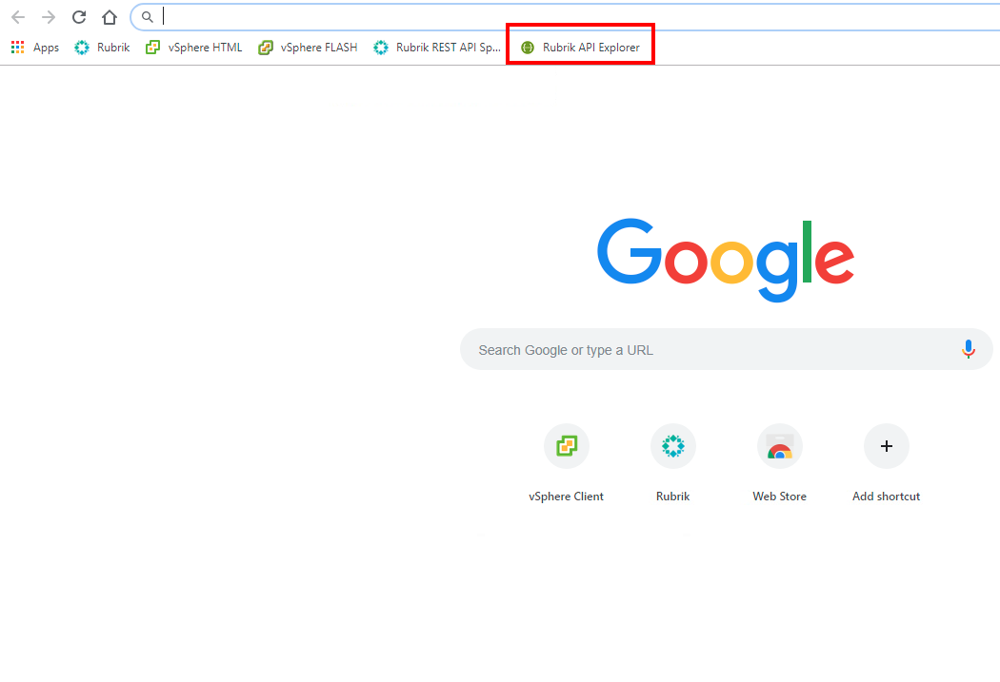
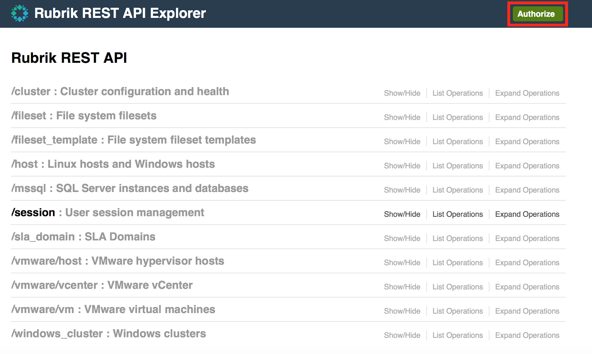
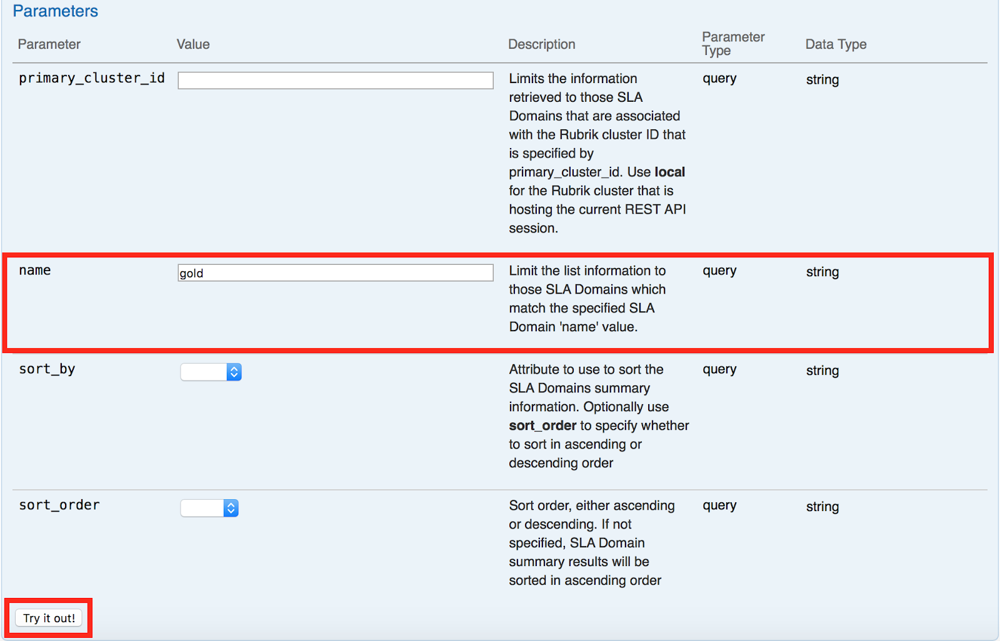

# API Explorer

To use the Rubrik API Explorer:

Open a new tab in your web browser and navigate to the Rubrik API Explorer bookmark (bookmarked in the Chrome web browser).

In the top right-hand corner, click **Authorize.**

Authenticate using the following credentials:

* Username: `admin`
* Password: `Welcome10!Rubrik`

Navigate to `/sla_domain` and click **Show/Hide**. Click **Get list of SLA Domains**.

Under **Parameter**, enter the **Value** `Gold` for **name**.

Click **Try it out!**

Notice the **Response Body**. There should be at least one response for Gold. This details the configuration of the Gold SLA Domain. If you scroll down you can even determine how many and what type of machines are protected by the Gold SLA.

