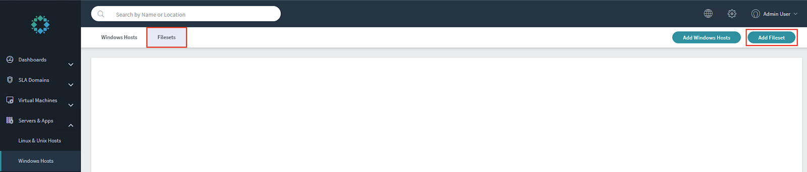
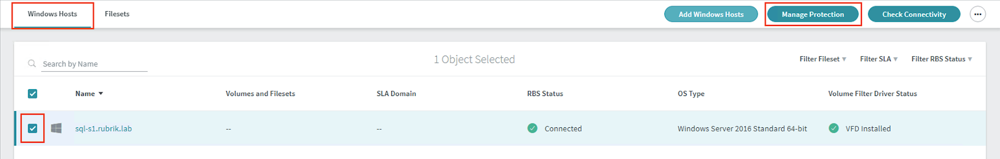
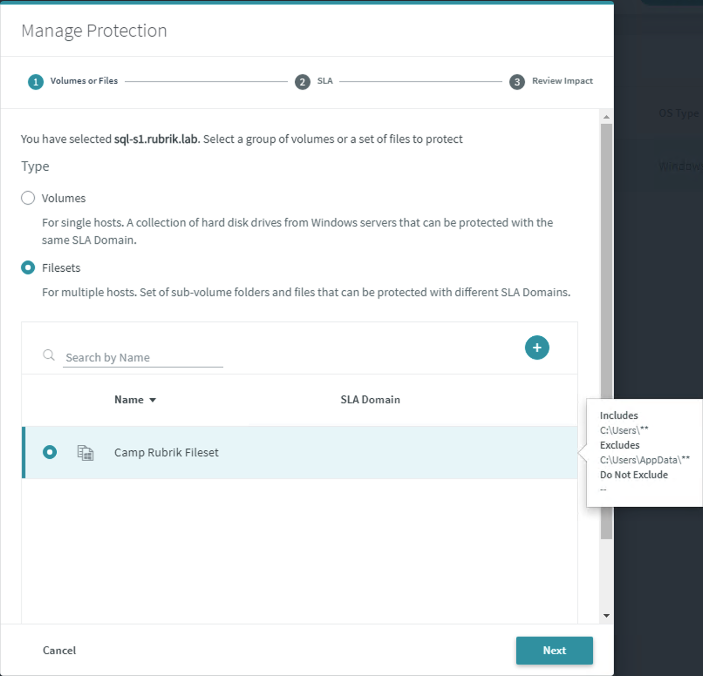

# Filesets

A fileset defines a set of files and folders on a Linux host, a Windows host, or a NAS share. The Rubrik cluster interprets a fileset based on the values provided in the Include, Exclude, and Do Not Exclude fields. The Rubrik cluster applies a set of rules to the values provided in these fields and permits several types of values to be added to the fields. The Rubrik cluster uses the filesets that are assigned to a host or share to determine which data to manage and protect.

To create a fileset:

In the Rubrik UI, on the left-side menu, click **Servers & Apps** &gt; **Windows Hosts**. The Windows Hosts page appears.

Select **Filesets** and then **Add Fileset**.

The Add Fileset dialog appears. Enter the following values:

* Fileset Name: `Camp Rubrik Fileset`
* Include: `C:\Users\**`
* Exclude: `C:\Users\AppData\**`

The fileset should resemble the following image.

Click **Add**.

Return to the **Windows Hosts** tab, select the `sql-s1` workload, and then choose **Manage Protection**.

Select **Filesets** as the Type and choose the `Camp Rubrik Fileset` created in a previous step.

Press **Next** and select the `Camp Rubrik` SLA Domain. Press **Finish**.

A host or share can be paired with several different filesets, with each host fileset or share fileset protecting a different set of data. Each of the host filesets or share filesets can be assigned to a different SLA Domain, permitting different levels of protection for each set of data.

