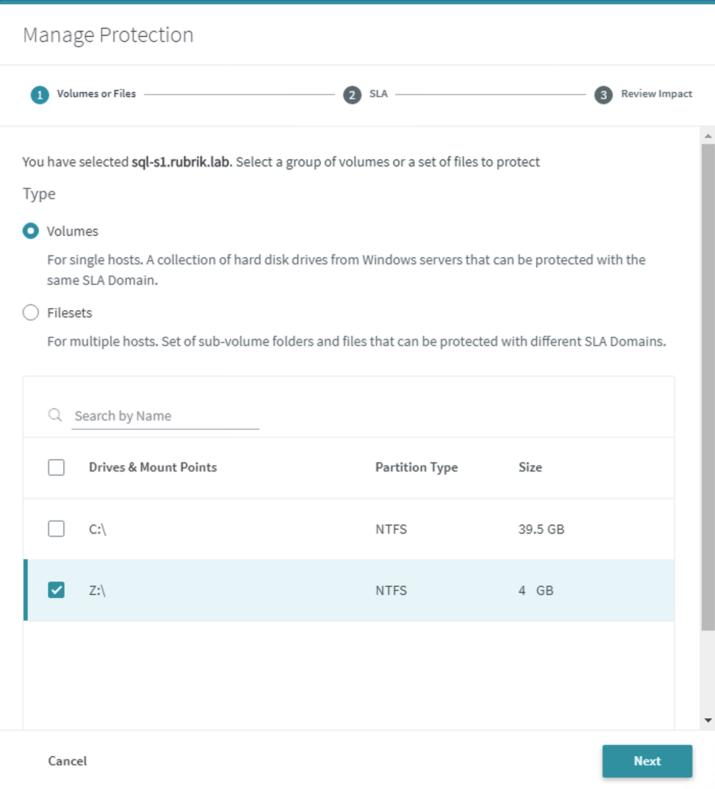
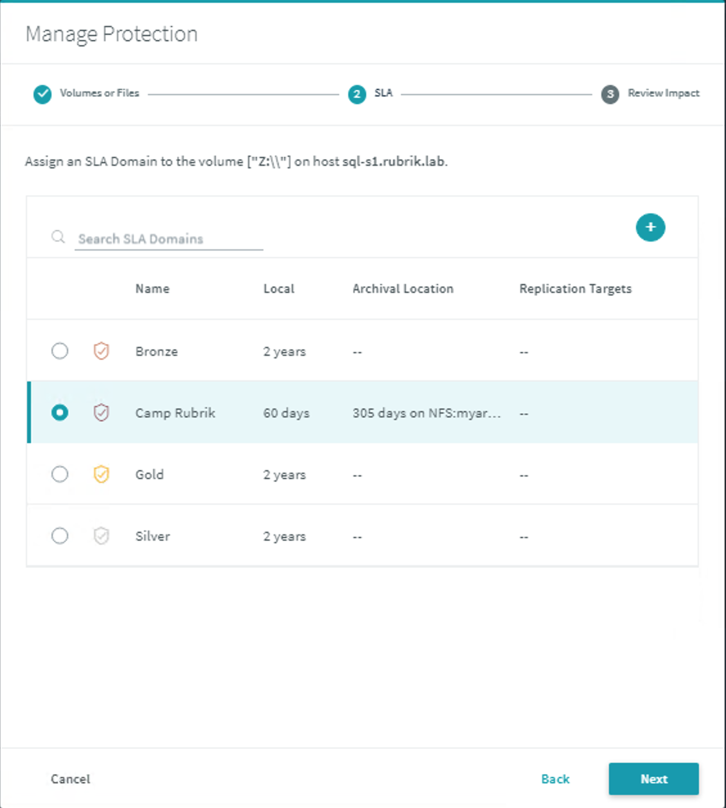
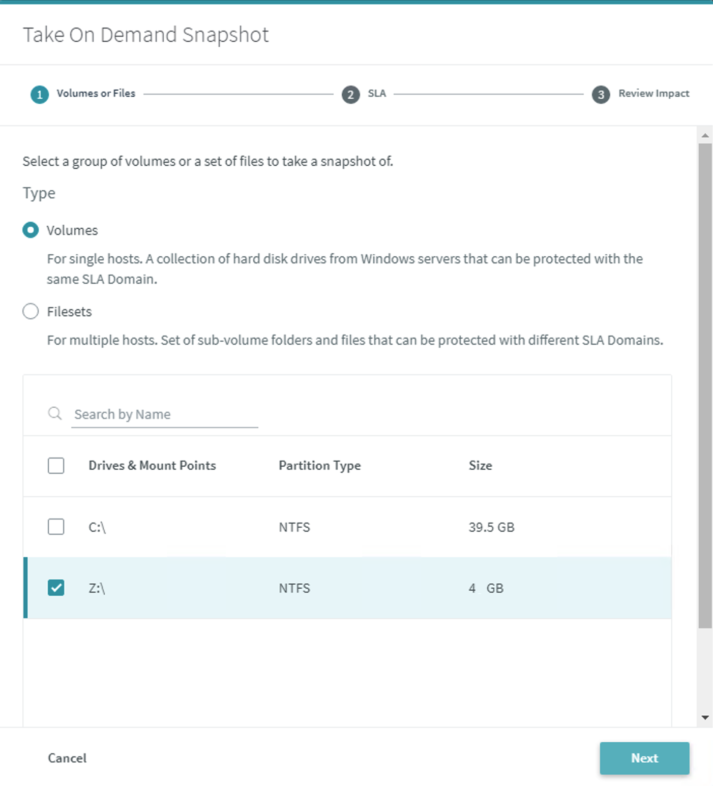
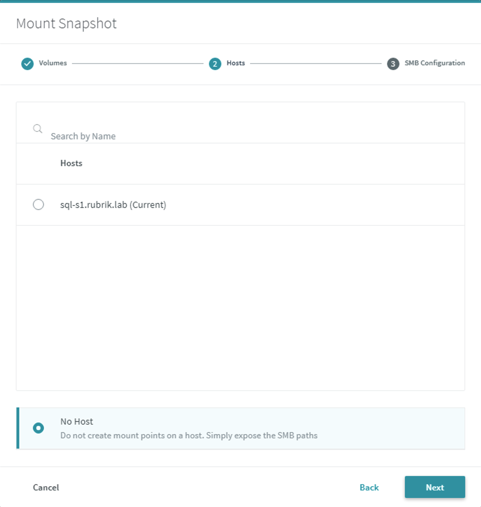
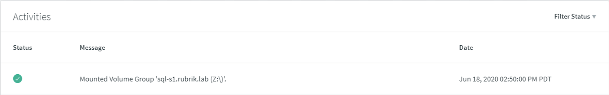
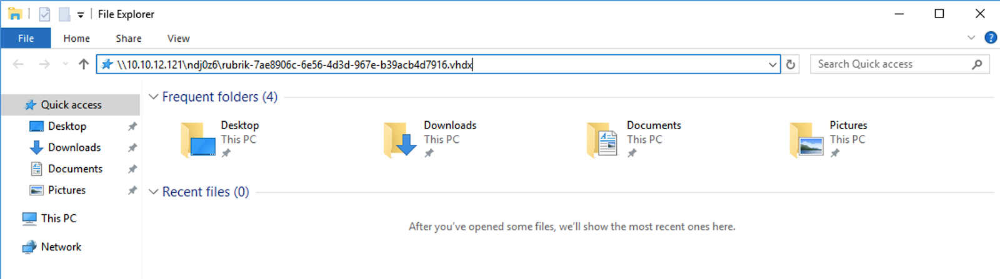

# Windows Volume Protection

A Rubrik cluster can protect a group of drives on a Windows server. Protecting Windows volumes uses the Rubrik Backup Service on a Windows host to create a Virtual Hard Drive \(VHD\) file.

To protect a Windows volume:

In the Rubrik UI, on the left-side menu, click **Servers & Apps** &gt; **Windows Hosts**. The Windows Hosts page appears.

Select the `sql-s1` workload, and then choose **Manage Protection**.

Select **Volumes** as the Type and choose the `Z:\` drive. Press **Next**. 

Select the `Camp Rubrik` SLA Domain. Press **Next**.

Review the changes and press **Finish**. 

Click on the `sql-s1` workload to navigate to the host page. Note the Volumes and Filesets pane. Press **On-Demand Snapshot** to take a backup. 

The **On-Demand Snapshot** dialog appears, ensure the `Z:\`drive is selected and press **Next**.

Press **Next** and select the `Camp Rubrik` SLA Domain. Press **Finish**. Note that an on-demand snapshot can be managed by a separate policy to specify a different retention period. 

Click on the globe menu in the Activity Log. The **Activities** screen reports the latest status of the snapshot operation. Select the message under Activities to review the Activity Detail. 

A Live Mount of a volume group can provide direct access to the volumes in the group, allowing for quick recovery. To do so:

Locate the **Snapshots** calendar view screen and find a date indicated by a green dot.  Click on the green dot to see one or more available snapshots from that date.

Click on the ellipsis (**...**) menu and select **Mount**.  

In the **Mount Snapshot** screen, ensure the checkbox next to the `Z:\` is selected and click **Next** to continue.

Select the radio button next to **No Host**. This will expose the SMB path during the mount operation. Click **Next** to continue. 

Enter the following information on the **SMB Configuration** screen:

* Domain: `rubrik.lab`
* Usernames: `demo`
* Active Directory Groups: `rubrikgroup`
* Client IP: `10.0.2.100`

The process will take a few moments to complete to expose the SMB share. You can review progress in the **Activities** pane. 

On the left-side menu, click **Live Mounts** > **Windows Volumes**. Hover over the `sql-s1.rubrik.lab` server name to view the SMB Path details. Click the SMB Path to copy the information into the Clipboard.

Open the Windows File Explorer application on Jump1. Paste the contents of the Clipboard in the Navigation window of File Explorer and press **Enter**.

In this case, notice the Live Mount has mounted the `E:\volume` as Data. There is a Files folder listed with seven files listed.

