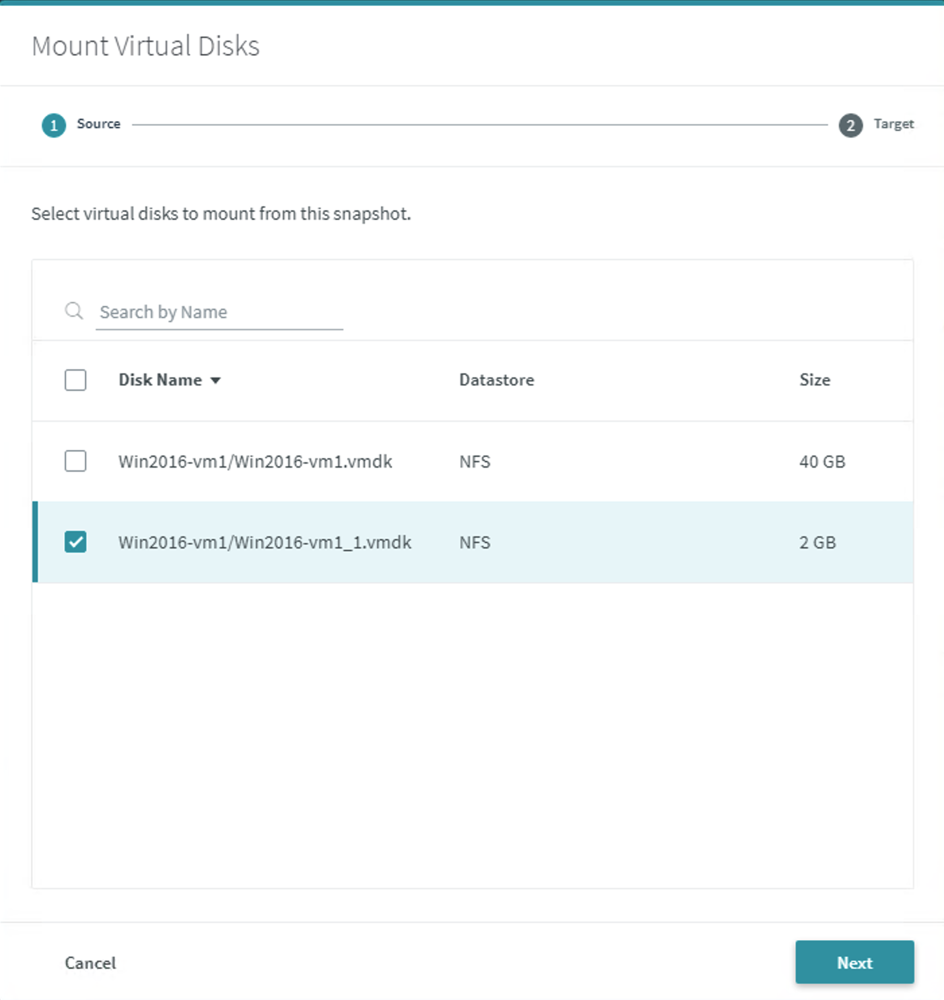
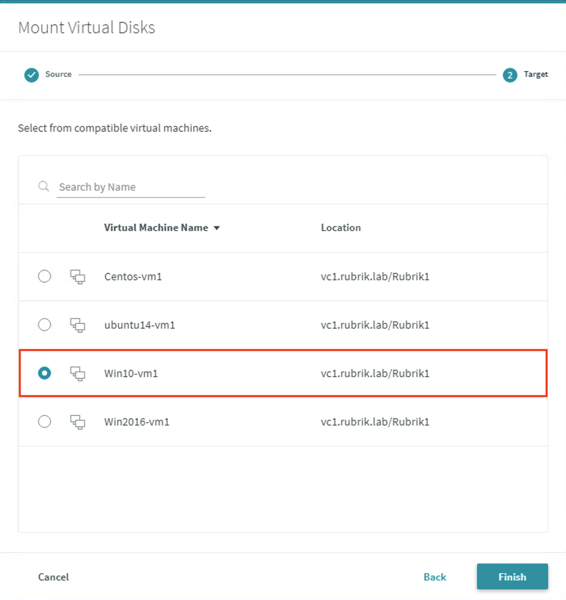
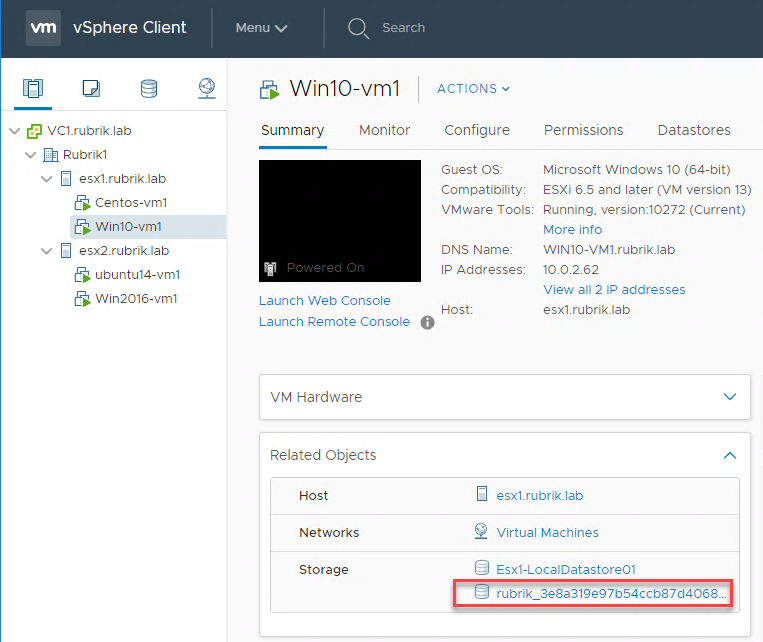
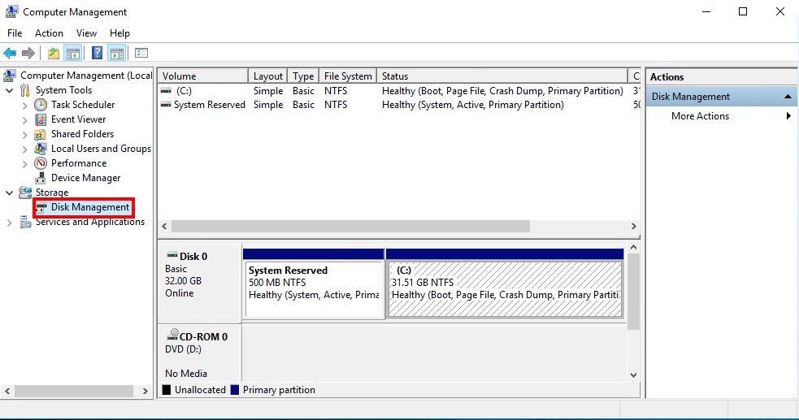
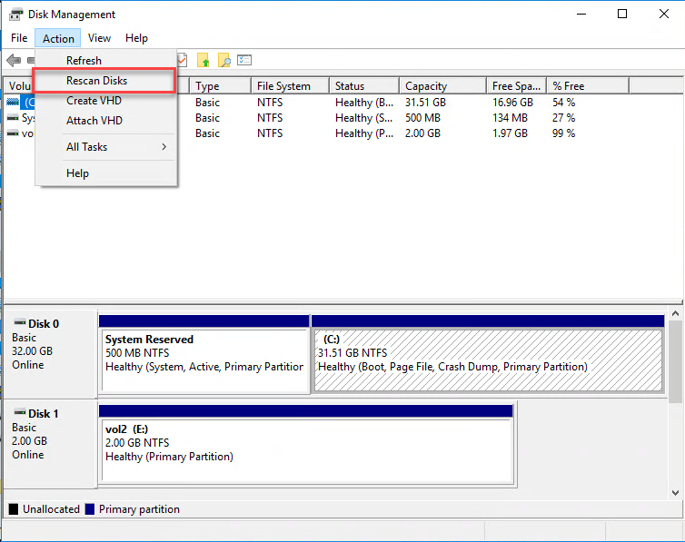
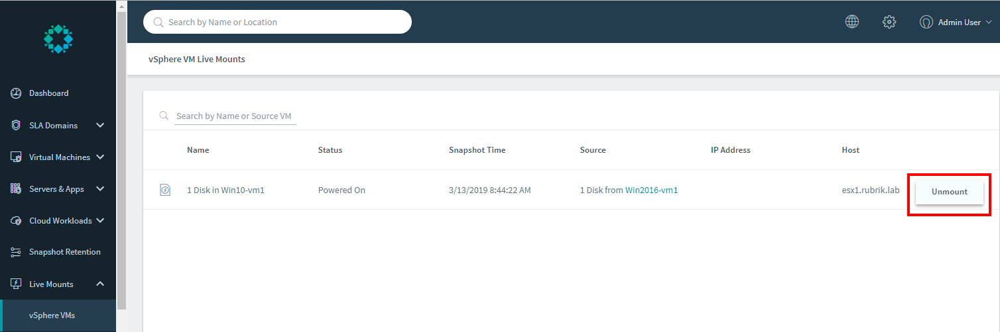

# VMDK Live Mount

To mount a virtual disk:

Using your assigned Windows 2016 Server (`Win2016-vm1`), select a snapshot by clicking on the blue dot on an available date. (**Virtual Machines &gt; vSphere VMs**)

Open the ellipsis (`...`) menu for the snapshot date chosen.

Choose **Mount Virtual Disks**.

Multiple disks should be listed. Select the checkbox in front of the 2GB drive.

After clicking on **Next**, you have the option of selecting any of your VMs to mount the disk on. Select the radio button in front of the `Win10-vm1` virtual machine and click Finish.

This will live mount the VMDK to the Windows 10 VM. You can check this by opening up the HTML5 vSphere client from the Chrome bookmark bar.

After logging into the vSphere client, click on `Win10-vm1` and look at the **Related Objects** to see the NFS datastore mounted from the Rubrik cluster.

To see that the virtual disk is added to the VM, click on Launch Web Console. You may need to login using the following credentials:

* Username: `DemoRubrik`
* Password: `Welcome10!`

Right click on the Windows Start Menu and select **Computer Management**.

Select **Disk Management** under **Storage** to open up the Windows Disk Management screen.

If you don’t see a `vol2`, you may need to refresh the disks. If needed, select **Action** and then **Rescan Disks**.

This VMDK has been mounted as part of the recovery process.

Return to Windows Explorer and verify that the new `E:\` drive (`vol2`) has appeared.

Navigate to the `E:\logos` folder on the disk and verify the Rubrik logos exist.

Return to the Rubrik UI and navigate to **Live Mounts** &gt; **vSphere VMs**, select the ellipsis (`...`) menu choose **Unmount**. Confirm the unmount.

You have now completed the Life-Saving badge!