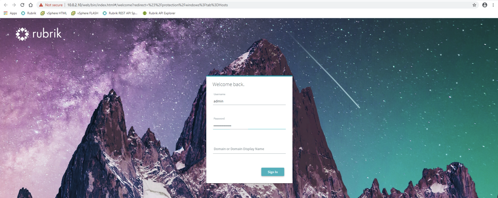
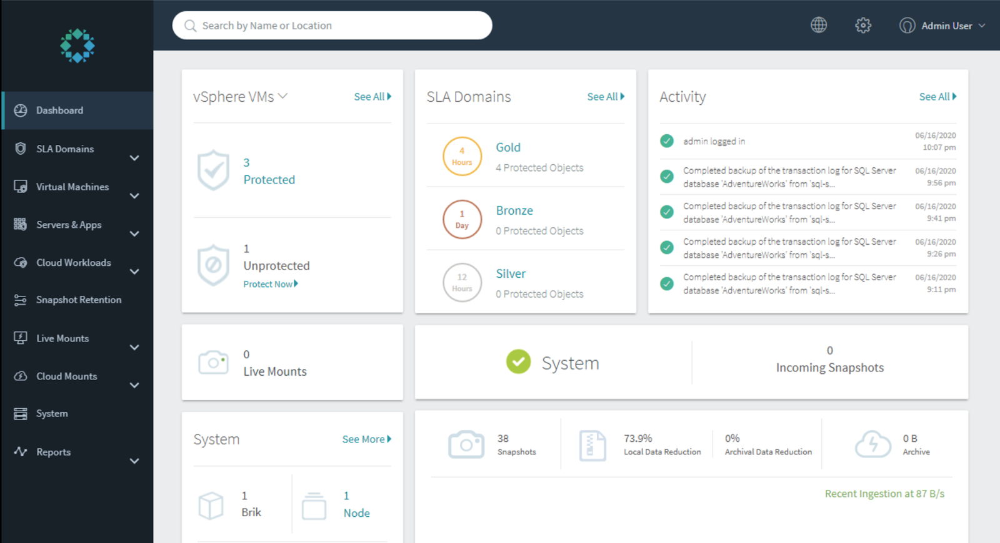
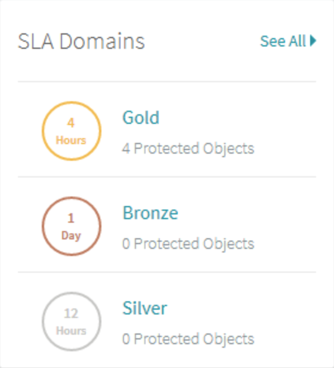
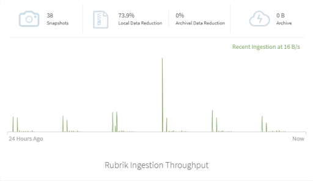

# Dashboard Walkthrough

Rubrik’s simple user interface is built on a API-driven framework with a HTML5 web user interface. To see it for yourself:

Once you have accessed the Camp Rubrik lab environment, select the **Jump1** Host and authenticate using the following OS credentials:

* Username: `demo@rubrik.lab`
* Password: `Welcome10!`

Open up the web browser \(Chrome\) and select the shortcut for the Rubrik UI. Login using the following credentials:

* Username: `admin`
* Password: `Welcome10!Rubrik`

Once authenticated, the Rubrik UI will default to the **Dashboard** page.

Let’s explore the various Dashboard panes.

The **vSphere VMs** pane provides a high-level overview of how many vSphere objects are protected by an SLA Domain.

Click on **vSphere VMs** to display the dropdown box that allows you to view a protection overview by workload type.

**SLA Domains** provides an overview of each SLA Domain and how many objects are being protected.

**Activity** pane lists all currently and recently completed tasks.

Towards the middle of the Dashboard screen, you can see the number of active **Live Mounts** as well as the number of **Incoming Snapshots**.

At the bottom, you are able to get a quick peek at the number of snapshots residing on this Rubrik cluster, percent data reduction using deduplication and compression, and amount of data archived.

Looking at the bottom left of the Dashboard, select **See More** in the **System** pane. This section details the specs of the Rubrik cluster as well as some performance details.

