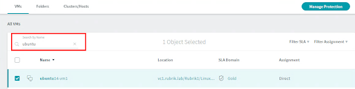
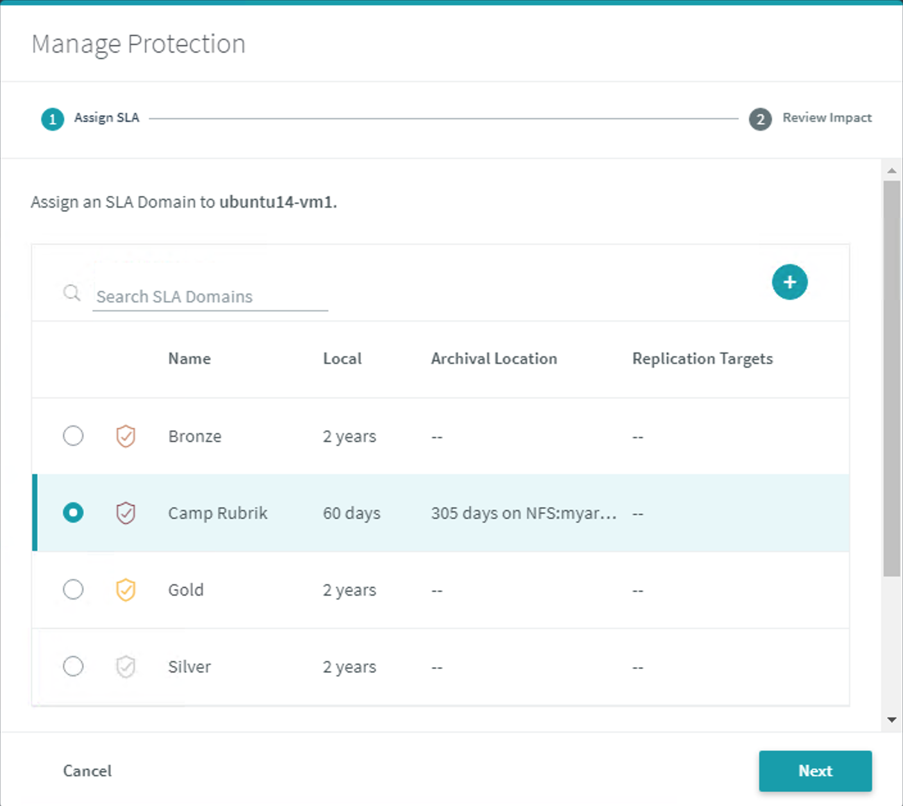
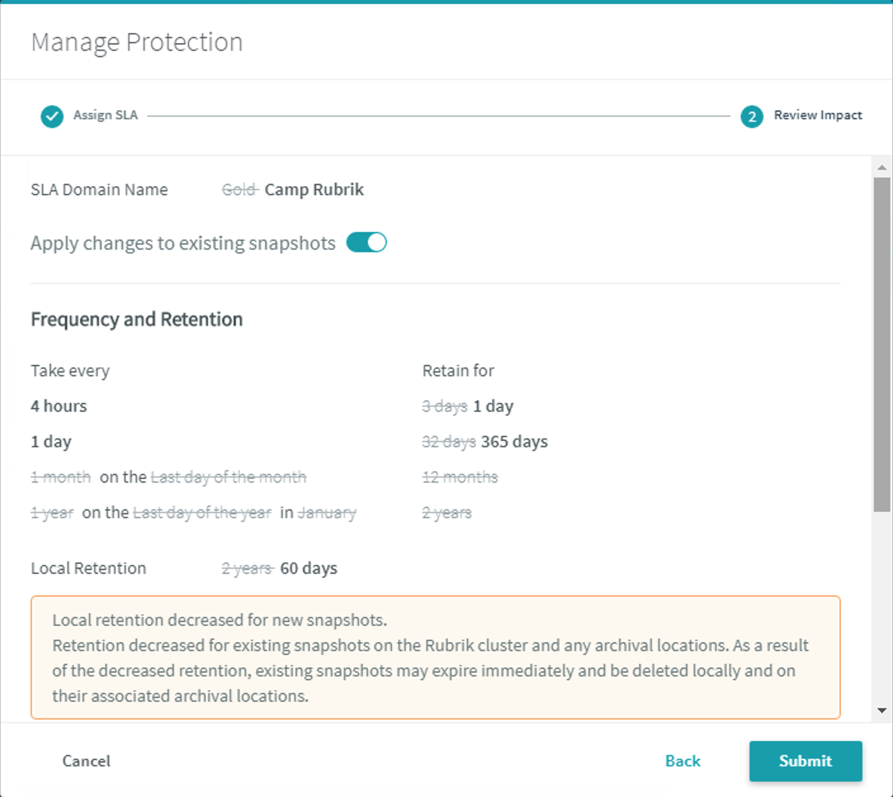

# Apply an SLA Domain

An SLA Domain may be applied at a broad level - such as the management server \(e.g. vCenter Server\), folder, host, cluster, or tag. This enables newly provisioned workloads to automatically inherit protection from a higher level resource. Alternatively, an SLA Domain may be granularly applied per object to achieve specific data protection objectives.

To do so:

In the web UI, on the left-side menu, click **Virtual Machines** &gt; **vSphere VMs**. The vSphere VMs page appears, with the VMs tab selected.

Select **Clusters/Hosts**. The Clusters/Hosts tab appears.

Select the checkbox in front of the vCenter Server.

Notice that the **Manage Protection** button in the upper right-hand corner illuminates and is now clickable. Do not assign an SLA Domain at this time.

To place a granular policy on an individual object:

Select the **VMs** tab. The **VMs** page appears. Search for your Linux virtual machine running on vSphere. Type in `ubuntu` in the **Search by Name** field to locate the assigned Linux VM \(`ubuntu14-vm1`\).

Select the Ubuntu virtual machine and click **Manage Protection**.

Find and select the previously created `Camp Rubrik` SLA Domain and press **Next**.

Review the retention change caused by changing the SLA Domain.

Click **Submit**.

The VM will soon update to reflect it is protected by the selected SLA Domain.

You have now completed the Orienteering badge!

