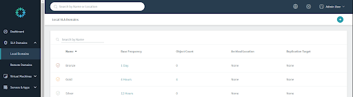
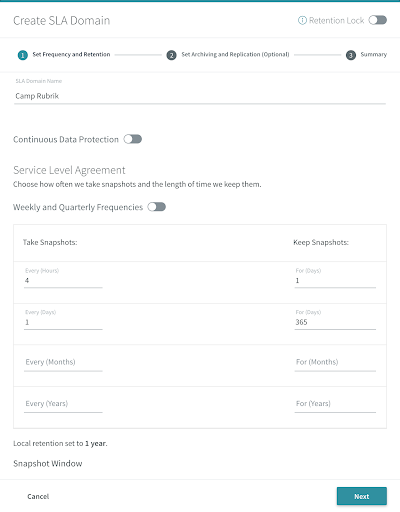

# Create an SLA Domain

To create an SLA Domain:

On the left-hand navigation pane, select **SLA Domains > Local Domains**.


**Trail Map:** 

_Local Domain_ - an SLA Domain that is created on the local Rubrik cluster. 

_Remote Domain_ - an SLA Domain that was created on a Rubrik cluster other than the local Rubrik cluster. Remote SLA Domains appear on a local Rubrik cluster when the local Rubrik cluster is a replication target.


In the upper right-hand corner, click the blue **+** icon.

Create an SLA Policy using the same configuration values demonstrated in the following image:


**Trail Map:** Continuous Data Protection enables you to protect your high value applications, running on vSphere, with near-zero RPOs. With CDP, you can recover from local or remote points in time with near zero RPOs for recovery from the latest point in time, or per-second granularity for recovery from historical points in time.


Select **Next** to configure replication and archive in the Remote Settings portion of the SLA Domain.

Enable the **Archival** toggle and select `NFS:myarchive` from the dropdown box. Change **Retention On Brik** as 60 days. Note that the arrow keys can be used to fine-tune the amount of time specified. Press the **Next** button.

Review and then click **Create** to finish.