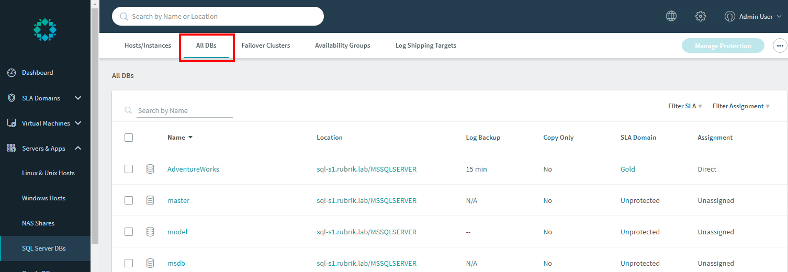
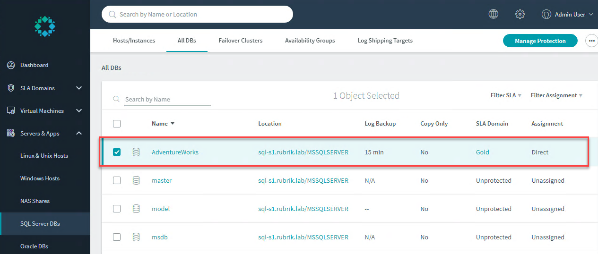
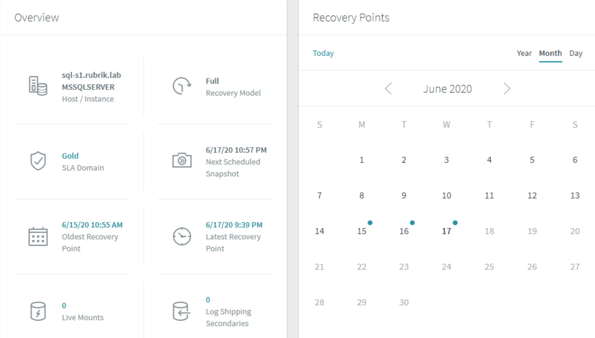
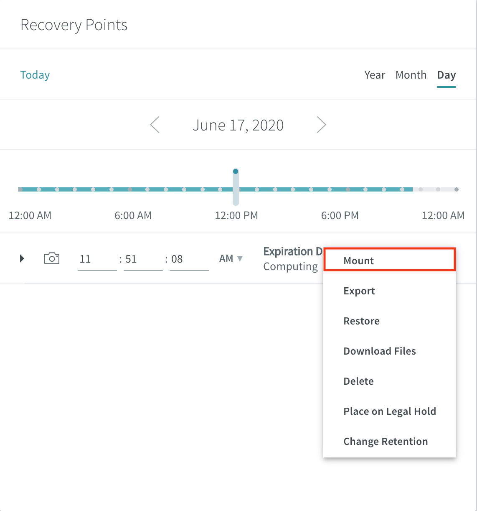
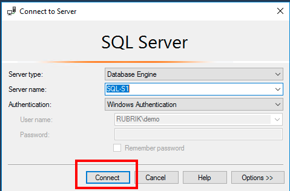
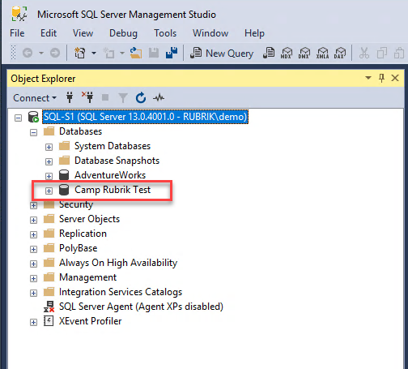
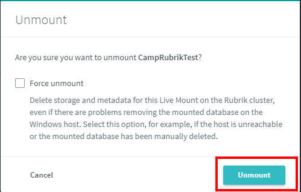

# SQL Live Mount

SQL Live Mount creates a new database from a point-in-time copy of the source database. The Rubrik cluster presents an SMB share of the new database directly from the Rubrik cluster storage layer. Using Live Mount to access a copy of a database can significantly reduce the RTO for the database, especially for granular level recovery.

A Live Mount database can be attached to an SQL Server instance on any Windows Server host that is running the Rubrik Backup Service. Transmissions between the Rubrik cluster and the host of the Live Mount are secured by end-to-end encryption.

Use Live Mount functionality to create a new database from a point-in-time copy of a source database:

On the left-side menu, click **Servers & Apps** &gt; **SQL Server DBs**. The Hosts/Instances window appears

Click **All** **DBs**. The **All DBs** window appears.

In the **Name** column, select the `AdventureWorks` database. Alternatively, enter `AdventureWorks` in the search field or use the filters at the top left of the list.

The **Local** page for the database appears; on the right hand side, the **Recovery Points** pane displays the **Month** view.

On the **Recovery Points** pane, select a day that has a green dot. The green dot indicates that at least one successful snapshot was created on that day.


**Trail Map:** While Rubrik always sends incremental backups of SQL Server databases, the green dot indicates the synthetically created Full to match the assigned policy. The points in time between fulls are offered for databases in Full Recovery mode using automatically rolling transaction logs. Restoring to a Full \(blue dot\) will be somewhat faster than choosing a point in time in between Fulls due to the time savings of not rolling transaction logs.


The **Recovery Points** card displays the **Day** view for the selected calendar date. Move the Recovery point slider to select a recovery point.

To select a recovery point other than a snapshot time, move the slider to choose that time. The time appears in the time field and the selected time icon changes. Alternatively, type a specific time into the time field.

Open the ellipsis \(`...`\) menu and select **Mount**.

The Mount Database dialog box appears.

In **Name**, select a Windows Server host, and click **Next**. You will automatically see all SQL Servers with the Rubrik connector installed. Alternatively, enter the name of a host in the search field.

In **Name**, select a SQL Server instance. Alternatively, enter the name of an instance in the search field.

In **Live Mount Database Name**, type a unique name.

Click **Mount**.

The Rubrik cluster shares the Live Mount over the SMB/CIFS protocol and automatically sets the protection state of the new database to **Do Not Protect**. This ensures the Rubrik cluster does not backup data stored on itself. The Rubrik cluster then mounts the share to the specified Windows Server host and attaches the Live Mount database to the specified SQL Server instance.

On the left-side menu of the web UI, click **Live Mounts** &gt; **SQL Server DBs**. The SQL Server DB Live Mounts page appears. Wait until the **Status** changes to **Available**. This may take approximately one minute.

On the desktop of Jump1, you will find a Remote Desktop icon labeled **SQLServer**. Double-click on the icon to open it.

Open Microsoft SQL Server Management Studio by clicking the icon on the bottom menu.

Click **Connect** at the login prompt.

In the left-hand column, expand the **Instance name** &gt; **Databases**. The Live Mounted Database should be listed.

Minimize the SQL Server RDP window and return to the Rubrik UI tab.

On the SQL Server DB Live Mounts page and open the ellipsis \(`...`\) menu next to the entry for your Live Mount database and select **Unmount**. A confirmation message appears.

Click **Unmount** once more to confirm. The Rubrik cluster detaches the database from the SQL Server instance and unmounts the share from the Windows Server host.

