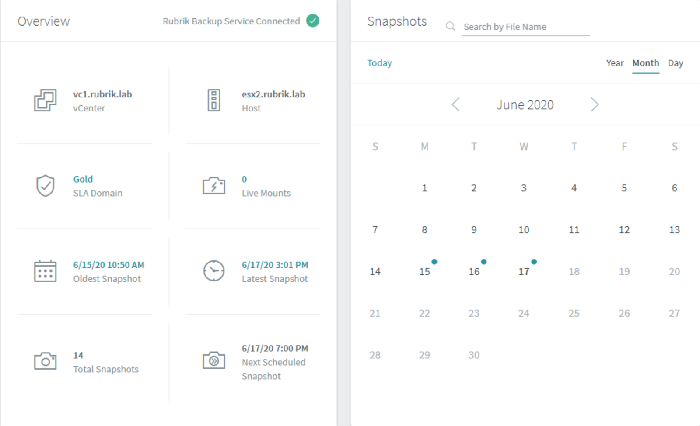
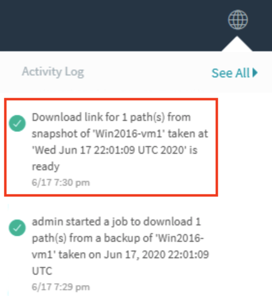
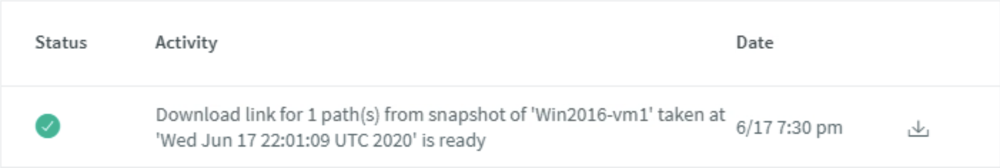

# File Recovery

To recover a file:

Search for the `Win2016-vm1` virtual machine running on vSphere.

The **Overview** pane provides information regarding the object’s location, configuration for CloudOn (if configured), the SLA Domain applied, Oldest and Latest Snapshot, total snapshots, etc. This can vary depending on location and type of machine. On the right-hand side there is a **Snapshots** calendar view. The next few steps will guide you on your journey to explore this more.

Select a date that has a blue dot by hovering over and then clicking on the blue dot (indicating there are recovery points from this day). All available snapshots are listed. An example screenshot below demonstrates all of the snapshots available for the selected VM. Note that the date and number of snapshots may differ from the following image.

Select the ellipses icon (`...`) next to one of the snapshots.

Click **Recover Files**. Next type in the search bar the word `hosts`. Two files are shown.

Click on the checkbox in front of the `C:\Windows\System32\drivers\etc\hosts` and then click **Next**.

There are four options shown: **Download**, **Overwrite original**, **Restore to separate folder**, and **Export**.

Do not select any of the options at this time and click **Cancel** to exit the dialog.


**Trail Map:** 

_Download_ - Rubrik cluster generates download links to use for file level restore (FLR) of files and folders, making it available to download locally to the user's device. 

_Overwrite original_ - files and folders restored directly to a guest file system of the protected workload whether a VM, physical server, or NAS share. This will overwrite the existing files on the machine. 

_Restore to separate folder_ - files and folders restored to a folder of your choosing.

_Export_ - allows you to restore files and folders to a different machine.


In the Rubrik UI, locate the **Search by File Name** in the **Snapshots** view and type in the word `hosts` to locate the file.

Click on the `C:\Windows\System32\drivers\etc\hosts`. On the window that appears, choose a version of the file (screenshot below) and select the ellipses (`...`).

Choose **Download**.

This may take a few moments. Click on the globe icon in the top right corner of the Rubrik UI to review the notification informing you that the file is ready to download. Click on the “Download link” message.

On the window that opens, click on the download link.

On your Jump1 host accessing the lab environment, browse to the **Downloads** folder to view hosts.

You have now completed the Search & Rescue badge!