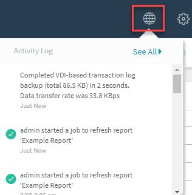
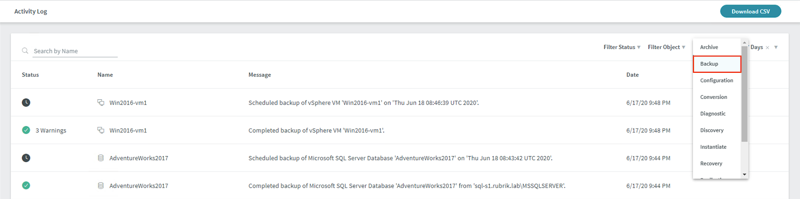

# Activities & Notifications

The **Activity Log** and **Notifications** is where you can view and monitor the current state of time-sensitive tasks. This is useful to determine success, warning, and failures of any backup or archival related tasks within the Rubrik cluster.

In the top right hand bar of the Rubrik UI is the Activity Log world icon.

Click the world icon to see all task related activity in progress and completed on the cluster.

Click **See All** and it will take you to a page with only activity details.

Select **Filter by type** and choose **Backup** to view only backup related tasks.

Scroll through and determine any recent warnings or failures that may require your attention.

Take note of the status, name, message, and date/time stamp of any tasks that require further investigation.

You have now completed the Signs, Signals & Codes badge!