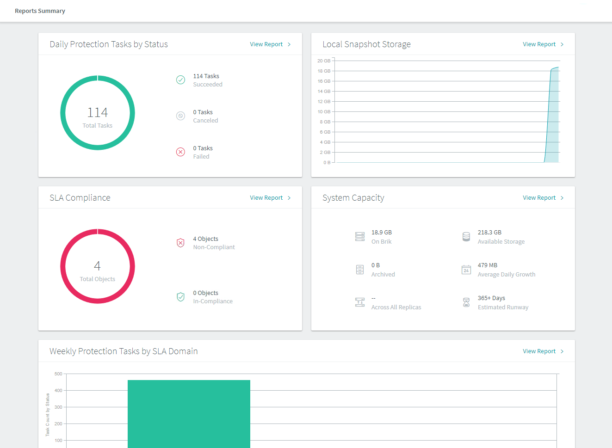
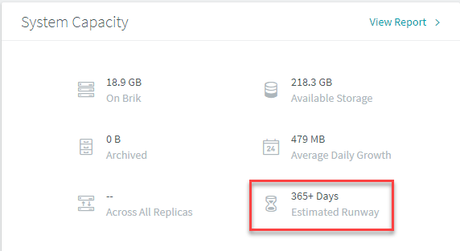
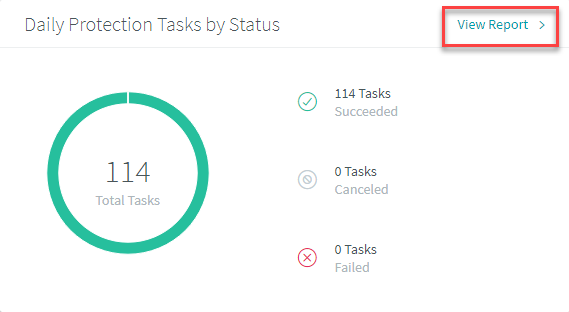
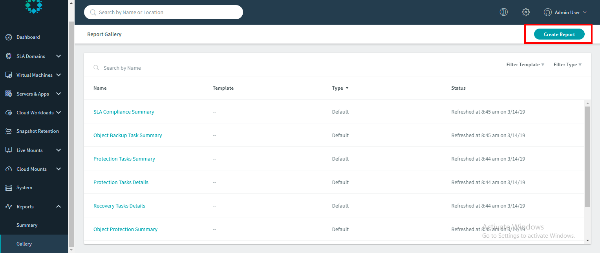
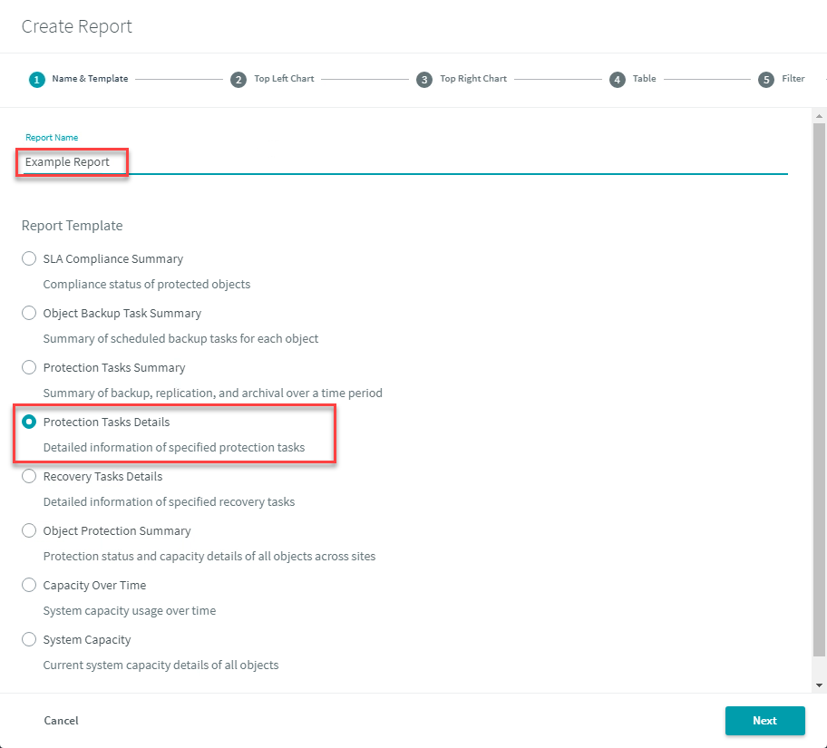

# Envision

Rubrik Envision provides customizable data protection reports with valuable information from the Rubrik cluster. Envision gives insight into historical information based on Protection Tasks, SLA Compliance, and System Capacity.

You can explore Envision in two formats:

* Reports Summary
* Reports Gallery

In the **Reports Summary** you can view or create individual reports in the Daily Protection Tasks by Status, SLA Compliance, Local Snapshot Storage, System Capacity, or Weekly Protection Tasks by SLA Domain sections. Let’s explore that section:

In the Rubrik UI, in the left-hand pane, select **Reports** &gt; **Summary**.

The Protection Tasks Details page appears.

Scroll down to **System Capacity** and you will notice: On Brik, Available Storage, Archived, Average Daily Growth, Across All Replicas, and Estimated Runway.

One of the most critical details here is the **Estimated Runway** that reports the estimated number of days remaining before additional data storage space is required on the Rubrik cluster. This is a critical metric to have available on any system that leverages data reduction combining incremental forever, deduplication, and compression.

Scroll back up to **Daily Protection Tasks by Status** and click **View Report**.

The **Protection Tasks Details** page appears. Scroll down to where you can **Search by Object Name** and supply dynamic filters.

Type **`win`** to search for all objects that have been protected with the word **`win`** in it.

Now select **Filter SLA Domain** and select the Gold SLA Domain to view.

Now click **Gallery** on the left-side menu under Reports and the Reports Gallery appears.

Click the **Create Report** button in the right-side top corner.

The Create Report dialog appears where you can create your own Custom Report.

Name the report **Example Report** and select **Protection Tasks Details** as the Report Template.

There are several different combinations of reports that you can create to provide you with useful information such as:

* Data Reduction Summary - Last 30 Days
* Average Job Durations - Last 7 Days
* System Capacity by Object Type - Last 30 Days
* Daily Backup Administrator Report \(You will create this one\)
* Daily DBA Report

Select the following items to create a Daily Backup Administrator Report. You will need to click Next to get to each new report.

| **Report Type** | **Created from "Protection Tasks Details"** |
| :--- | :--- |
| **Top Left Chart** | **Daily Protection Tasks by Status** |
| Attributes | Task Type |
| Measures | Task Count by Status |
| Chart Type | Stacked Horizontal |
| **Top Right Chart** | **Daily Failed Tasks by Object Name** |
| Attributes | Object Name |
| Measures | Failed Tasks |
| Chart Type | Vertical |
| **Table** | **Protection Tasks Details** |
| Search by Attribute | SLA Domain, Task Status, Task Type, Location, Object Name, Object Type |
| Search by Measure | Start Time, End Time, Duration, Data Transferred, Data Stored, Dedup Ratio, Logical Dedup Ratio |
| **Filter** |  |
| Date | Past 24 hours |
| Task Status, Task Type, SLA Domain, Object Type, Object Name, Location, Cluster Location | none |

Observe the report once it has been generated \(note that it could take a few moments to generate\).

