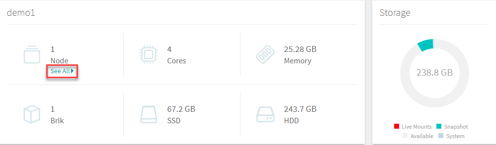
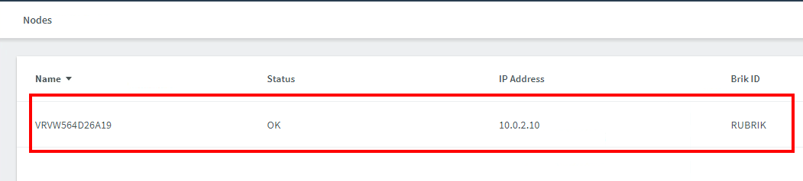

# System

The System page is where you can see various hardware and storage metrics at a glance. This is useful to see system utilization levels, hardware health or failure, and more.

In the Rubrik UI, in the left-hand pane, click **System**.

Note the resource configurations for the entire cluster: # of nodes, cores, memory, and more.

Click **See All** underneath the node count to see individual node information. Then click on an individual node to see detailed information for that node.

Go back to the **System** screen.

Note the other metrics available - I/O Throughput, IOPs, and Storage.

To determine whether the I/O Throughput is trending optimally based on your network you can view it easily here and make a decision to investigate further.

